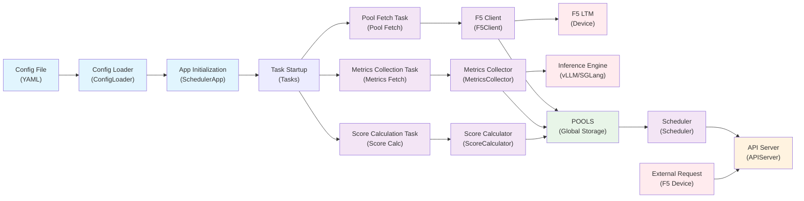
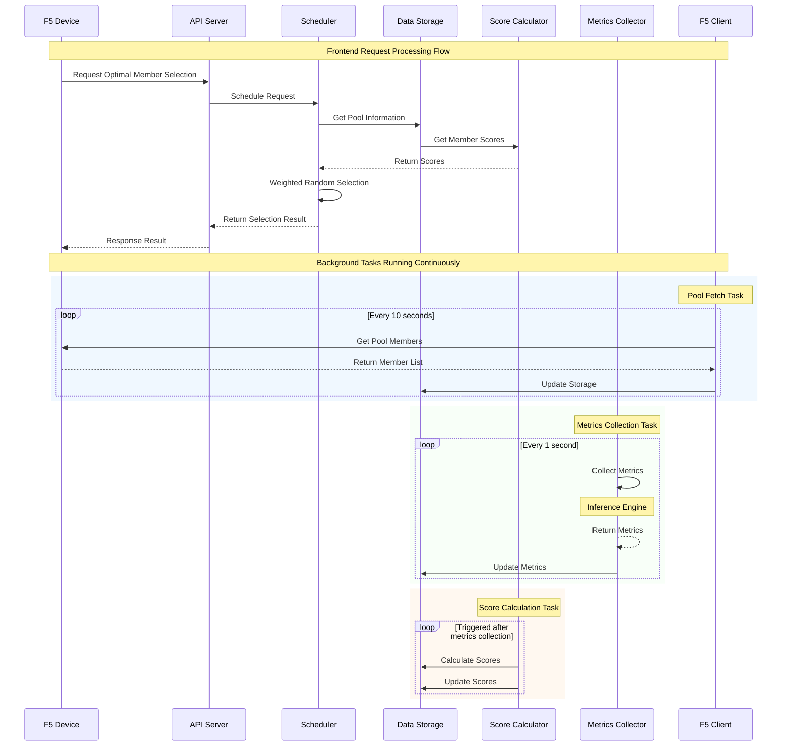
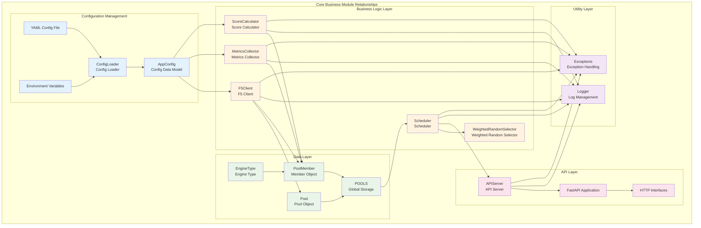
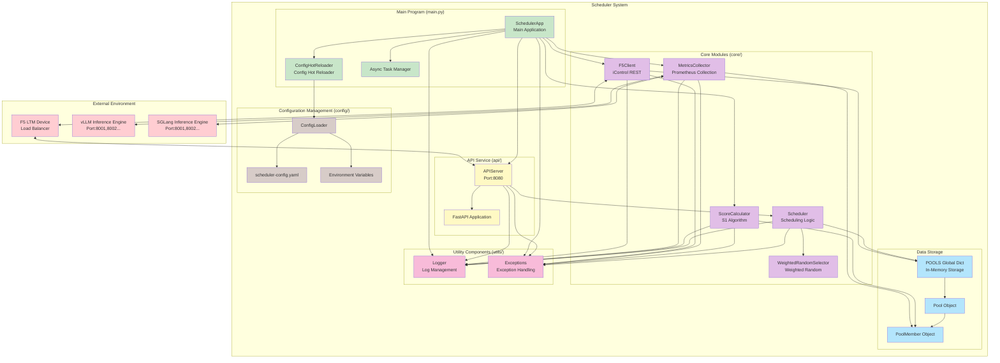

# F5 LLM Inference Gateway Scheduler - Module Relationships

## System Architecture Overview

```
┌─────────────────────────────────────────────────────────────────────────────────────┐
│                       F5 LLM Inference Gateway Scheduler                            │
├─────────────────────────────────────────────────────────────────────────────────────┤
│                                                                                     │
│  ┌─────────────┐    ┌──────────────────────────────────────────────────────────┐    │
│  │ External User│───┤                 HTTP API Layer                           │    │
│  │ (F5 Device)  │   │  ┌─────────────────┐  ┌─────────────────────────────────┐│    │
│  └─────────────┘    │  │  POST /select   │  │  GET /pools/status              ││    │
│                     │  │  GET /health    │  │  POST /simulate                 ││    │
│                     │  └─────────────────┘  └─────────────────────────────────┘│    │
│                     └──────────────────────────────────────────────────────────┘    │
│                                          │                                          │
│  ┌─────────────────────────────────────────────────────────────────────────────────┐│
│  │                          Application Coordination Layer (main.py)               ││
│  │  ┌──────────────────┐  ┌──────────────────┐  ┌──────────────────────────────┐   ││
│  │  │  Config Reloader │  │  Task Scheduler  │  │  Signal Handler              │   ││
│  │  │  (ConfigReloader)│  │ (Task Scheduler) │  │ (Signal Handler)             │   ││
│  │  └──────────────────┘  └──────────────────┘  └──────────────────────────────┘   ││
│  └─────────────────────────────────────────────────────────────────────────────────┘│
│                                          │                                          │
│  ┌─────────────────────────────────────────────────────────────────────────────────┐│
│  │                                Core Business Layer                              │ │
│  │  ┌──────────────┐  ┌──────────────┐  ┌──────────────┐  ┌─────────────────────┐  │ │
│  │  │   F5 Client  │  │ Metrics      │  │ Score        │  │     Scheduler       │  │ │
│  │  │ (F5Client)   │  │ Collector    │  │ Calculator   │  │  (Scheduler)        │  │ │
│  │  └──────────────┘  │              │  └──────────────┘  │  ┌─────────────────┐│  │ │
│  │                    │              │                    │  │ Weighted Random ││  │ │
│  │                    └──────────────┘                    │  │ Selector        ││  │ │
│  │                                                        │  └─────────────────┘│  │ │
│  │                                                        └─────────────────────┘  │ │
│  └─────────────────────────────────────────────────────────────────────────────────┘ │
│                                          │                                           │
│  ┌─────────────────────────────────────────────────────────────────────────────────┐ │
│  │                               Data Model Layer                                  │ │
│  │  ┌──────────────┐  ┌──────────────┐  ┌──────────────┐  ┌─────────────────────┐  │ │
│  │  │   Pool       │  │ PoolMember   │  │  EngineType  │  │   POOLS Global      │  │ │
│  │  │   (Pool)     │  │ (Member Obj) │  │ (Engine Type)│  │   Storage           │  │ │
│  │  └──────────────┘  └──────────────┘  └──────────────┘  │ (Dict[str,Pool])    │  │ │
│  │                                                        └─────────────────────┘  │ │
│  └─────────────────────────────────────────────────────────────────────────────────┘ │
│                                          │                                           │
│  ┌─────────────────────────────────────────────────────────────────────────────────┐ │
│  │                           Configuration Management Layer                        │ │
│  │  ┌──────────────┐  ┌──────────────┐  ┌──────────────┐  ┌─────────────────────┐  │ │
│  │  │ Config       │  │ Config Data  │  │ Config File  │  │ Environment         │  │ │
│  │  │ Loader       │  │ Model        │  │ (YAML File)  │  │ Variables           │  │ │
│  │  │(ConfigLoader)│  │ (AppConfig)  │  └──────────────┘  │ (Environment)       │  │ │
│  │  └──────────────┘  └──────────────┘                    └─────────────────────┘  │ │
│  └─────────────────────────────────────────────────────────────────────────────────┘ │
│                                          │                                           │
│  ┌─────────────────────────────────────────────────────────────────────────────────┐ │
│  │                            Utility Support Layer                                │ │
│  │  ┌──────────────┐  ┌──────────────┐  ┌──────────────┐  ┌─────────────────────┐  │ │
│  │  │   Logger     │  │ Exception    │  │ Type         │  │ Utility             │  │ │
│  │  │ Management   │  │ Handling     │  │ Definitions  │  │ Functions           │  │ │
│  │  │  (Logger)    │  │ (Exceptions) │  │  (TypeDefs)  │  │    (Utilities)      │  │ │
│  │  └──────────────┘  └──────────────┘  └──────────────┘  └─────────────────────┘  │ │
│  └─────────────────────────────────────────────────────────────────────────────────┘ │
│                                                                                      │
└──────────────────────────────────────────────────────────────────────────────────────┘
```

## Detailed Module Relationships and Interfaces

### 1. Main Program Module (main.py)

**Responsibility**: Application coordinator and task scheduler

**Key Classes**:
- `SchedulerApp`: Main application class
- `ConfigHotReloader`: Configuration hot reloader

**Main Interfaces**:
```python
class SchedulerApp:
    async def initialize()           # Initialize all components
    async def start()               # Start the application
    async def stop()                # Stop the application
    async def apply_config_changes() # Apply configuration changes
```

**Dependencies**:
- Depends on `config` module for configuration management
- Depends on all business components in `core` module
- Depends on `api` module to provide HTTP services
- Depends on `utils` module for logging and exception handling

### 2. Configuration Management Module (config/)

**Responsibility**: Configuration file reading, parsing, validation, and hot reloading

**Key Classes**:
- `ConfigLoader`: Configuration loader
- `AppConfig`: Application configuration data model
- `GlobalConfig`: Global configuration
- `F5Config`: F5 connection configuration
- `SchedulerConfig`: Scheduler configuration
- `PoolConfig`: Pool configuration
- `MetricsConfig`: Metrics configuration

**Main Interfaces**:
```python
def load_config(config_file: str) -> AppConfig
def get_config_loader() -> ConfigLoader

class AppConfig:
    global_config: GlobalConfig    # Global configuration
    f5: F5Config                  # F5 configuration
    scheduler: SchedulerConfig     # Scheduler configuration
    pools: List[PoolConfig]       # Pool configuration list
    modes: List[ModeConfig]       # Algorithm mode configuration
```

**Dependency Relationships**:
- Called by `main.py` for configuration loading
- Used by all business modules for configuration information

### 3. Core Business Module (core/)

#### 3.1 Data Models (core/models.py)

**Responsibility**: Define core data structures and global storage

**Key Classes**:
- `Pool`: Pool object containing member list
- `PoolMember`: Pool member object containing metrics and scores
- `EngineType`: Inference engine type enumeration
- `POOLS`: Global Pool storage dictionary

**Main Interfaces**:
```python
class Pool:
    def update_members_smartly()   # Smart update member list
    def get_pool_key()            # Get Pool unique identifier
    def find_member()             # Find specified member

class PoolMember:
    def metric_uri()              # Generate metrics URI

# Global functions
def get_pool_by_key(pool_name: str, partition: str) -> Pool
def add_or_update_pool(pool: Pool)
def get_all_pools() -> List[Pool]
```

#### 3.2 F5 Client (core/f5_client.py)

**Responsibility**: F5 LTM iControl REST API interaction

**Key Classes**:
- `F5Client`: F5 API client
- `F5Token`: F5 Token information dataclass

**Main Interfaces**:
```python
class F5Client:
    def __init__(host, port, username, password)    # Initialize client
    async def __aenter__()                          # Async context manager entry
    async def __aexit__()                           # Async context manager exit
    async def login() -> F5Token                    # Login to F5 to get Token
    async def delete_token(token: F5Token) -> bool  # Delete token on F5
    async def validate_token(token: F5Token) -> bool # Validate if Token is valid
    async def ensure_valid_token() -> F5Token       # Ensure valid Token
    async def get_pool_members(pool_name, partition) -> List[PoolMember]  # Get Pool member list
    async def close()                               # Close client
    async def _ensure_session()                     # Ensure session is created
    async def _extend_token_timeout(token) -> bool  # Extend Token timeout

@dataclass
class F5Token:
    token: str              # Token string
    name: str               # Token name
    expiration_time: float  # Expiration time
    timeout: int = 36000    # Timeout duration (seconds)
```

**Dependencies**:
- Depends on PoolMember class in `models`
- Depends on F5ApiError and TokenAuthenticationError classes in `utils.exceptions`
- Called by `main.py` for Pool member acquisition

#### 3.3 Metrics Collector (core/metrics_collector.py)

**Responsibility**: Collect performance metrics from inference engines

**Key Classes**:
- `MetricsCollector`: Metrics collector

**Main Interfaces**:
```python
class MetricsCollector:
    async def collect_pool_metrics()    # Collect Pool metrics
    async def collect_member_metrics()  # Collect member metrics
    def _parse_prometheus_metrics()     # Parse Prometheus format metrics
```

**Dependencies**:
- Depends on Pool and PoolMember classes in `models`
- Depends on ENGINE_METRICS configuration in `models`
- Called by `main.py` for metrics collection

#### 3.4 Score Calculator (core/score_calculator.py)

**Responsibility**: Calculate member scores based on metrics

**Key Classes**:
- `ScoreCalculator`: Score calculator

**Main Interfaces**:
```python
class ScoreCalculator:
    def calculate_pool_scores()      # Calculate scores for all Pool members
    def calculate_member_score()     # Calculate single member score
    def _s1_algorithm()             # S1 algorithm implementation
```

**Dependencies**:
- Depends on Pool and PoolMember classes in `models`
- Depends on algorithm parameters in configuration
- Called by `main.py` and `scheduler.py`

#### 3.5 Scheduler (core/scheduler.py)

**Responsibility**: Optimal member selection and weighted random algorithm

**Key Classes**:
- `Scheduler`: Main scheduler class
- `WeightedRandomSelector`: Weighted random selector

**Main Interfaces**:
```python
class Scheduler:
    async def select_optimal_member()  # Select optimal member
    def get_pool_status()             # Get Pool status
    async def simulate_selection()     # Simulate selection process

class WeightedRandomSelector:
    def select()                      # Weighted random selection
    def _weighted_random_choice()     # Weighted random algorithm implementation
```

**Dependencies**:
- Depends on all data structures in `models`
- Called by `api` module to provide scheduling services

### 4. API Service Module (api/)

**Responsibility**: Provide HTTP RESTful API interfaces

**Key Classes**:
- `APIServer`: API server
- `ScheduleRequest`: Schedule request model
- `ScheduleResponse`: Schedule response model

**Main Interfaces**:
```python
# HTTP interfaces
POST /scheduler/select                        # Select optimal member
GET /pools/{pool_name}/{partition}/status     # Get single Pool status
GET /pools/status                            # Get all Pools status
GET /health                                  # Health check
POST /pools/{pool_name}/{partition}/simulate  # Simulate selection process (test interface)
POST /pools/{pool_name}/{partition}/analyze   # Advanced probability analysis (test interface)
```

**Dependencies**:
- Depends on `core/scheduler.py` for scheduling processing
- Called by external clients 

### 5. Utility Support Module (utils/)

#### 5.1 Logger Management (utils/logger.py)

**Responsibility**: Unified logging management

**Key Classes**:
- `SchedulerLogger`: Logger manager

**Main Interfaces**:
```python
def init_logger(debug: bool, log_file: str, log_level: str) -> logging.Logger
def get_logger() -> logging.Logger
```

#### 5.2 Exception Handling (utils/exceptions.py)

**Responsibility**: Custom exception class definitions

**Key Classes**:
```python
class SchedulerException          # Base exception
class ConfigurationError          # Configuration error
class F5ApiError                 # F5 API error
class MetricsCollectionError     # Metrics collection error
class ScoreCalculationError      # Score calculation error
class SchedulingError            # Scheduling error
```

## Data Flow Diagram

```
┌─────────────┐    ┌──────────────┐    ┌─────────────────┐    ┌──────────────┐
│Config File  │───▶│Config Loader │───▶│App Initialization│───▶│Task Startup  │
│ (YAML)      │    │(ConfigLoader)│    │ (SchedulerApp)  │    │ (Tasks)      │
└─────────────┘    └──────────────┘    └─────────────────┘    └──────────────┘
                                                                      │
┌─────────────┐    ┌──────────────┐    ┌─────────────────┐           │
│   F5 LTM    │◀───│  F5 Client   │◀───│  Pool Fetch     │◀──────────┘
│  (Device)   │    │ (F5Client)   │    │  Task           │
└─────────────┘    └──────────────┘    └─────────────────┘
                                                │
                                                ▼
┌─────────────┐    ┌──────────────┐    ┌─────────────────┐
│ Inference   │◀───│ Metrics      │◀───│ Metrics         │
│ Engine      │    │ Collector    │    │ Collection Task │
│(vLLM/SGL)   │    │              │    │                 │
└─────────────┘    └──────────────┘    └─────────────────┘
                                                │
                                                ▼
┌─────────────┐    ┌──────────────┐    ┌─────────────────┐
│  POOLS      │◀───│ Score        │◀───│ Score           │
│ (Global     │    │ Calculator   │    │ Calculation     │
│  Storage)   │    │              │    │ Task            │
└─────────────┘    └──────────────┘    └─────────────────┘
       │
       ▼
┌─────────────┐    ┌──────────────┐    ┌─────────────────┐
│ Scheduler   │───▶│ API Server   │◀───│ External        │
│(Scheduler)  │    │(APIServer)   │    │ Request         │
│             │    │              │    │(F5 Device)      │
└─────────────┘    └──────────────┘    └─────────────────┘
```

## Key Interface Descriptions

### 1. Configuration Interface
- **Input**: YAML configuration file + environment variables
- **Output**: Structured configuration object (AppConfig)
- **Features**: Supports hot reloading, configuration validation, default value handling

### 2. F5 Interaction Interface
- **Protocol**: iControl REST API
- **Authentication**: Token-based authentication with automatic refresh
- **Data**: Pool member list (IP:Port)

### 3. Metrics Collection Interface
- **Protocol**: HTTP/HTTPS
- **Format**: Prometheus format metrics
- **Content**: Waiting queue length, GPU cache usage, etc.

### 4. Scheduling Interface
- **Input**: Pool name + candidate member list
- **Algorithm**: S1 algorithm + weighted random selection
- **Output**: Optimal member (IP:Port)

### 5. HTTP API Interface
- **Protocol**: RESTful API
- **Format**: JSON request/response
- **Functions**: Member selection, status query, health check


## Summary

The F5 LLM Inference Gateway Scheduler adopts a modular design architecture with the following characteristics:

1. **Layered Architecture**: Clear hierarchy from configuration layer to API layer with distinct responsibilities
2. **Loose Coupling Design**: Modules interact through interfaces, facilitating testing and maintenance
3. **Asynchronous Processing**: Supports high concurrency and non-blocking operations
4. **Configuration-Driven**: Behavior controlled through configuration files with hot reload support
5. **Extensibility**: Easy to add new inference engine types and algorithm modes
6. **Observability**: Comprehensive logging and monitoring mechanisms
7. **High Availability**: Complete exception handling and fault tolerance mechanisms

The system's core data flow is: **Configuration Loading → Member Acquisition → Metrics Collection → Score Calculation → Scheduling Selection → API Response**. All modules work together to provide intelligent load balancing scheduling services for F5 devices.

---

# Mermaid Format Charts

## 1. System Architecture Layered Diagram

```mermaid
graph TB
    subgraph "F5 LLM Inference Gateway Scheduler"
        subgraph "HTTP API Layer"
            A1["POST /scheduler/select"]
            A2["GET /pools/status"]
            A3["GET /health"]
            A4["POST /simulate"]
        end
        
        subgraph "Application Coordination Layer (main.py)"
            B1["Config Reloader<br/>(ConfigReloader)"]
            B2["Task Scheduler<br/>(Task Scheduler)"]
            B3["Signal Handler<br/>(Signal Handler)"]
        end
        
        subgraph "Core Business Layer"
            C1["F5 Client<br/>(F5Client)"]
            C2["Metrics Collector<br/>(MetricsCollector)"]
            C3["Score Calculator<br/>(ScoreCalculator)"]
            C4["Scheduler<br/>(Scheduler)"]
            C5["Weighted Random Selector<br/>(WeightedRandom)"]
            C4 --> C5
        end
        
        subgraph "Data Model Layer"
            D1["Pool<br/>(Pool Object)"]
            D2["PoolMember<br/>(Member Object)"]
            D3["EngineType<br/>(Engine Type)"]
            D4["POOLS Global Storage<br/>(Dict[str,Pool])"]
        end
        
        subgraph "Configuration Management Layer"
            E1["Config Loader<br/>(ConfigLoader)"]
            E2["Config Data Model<br/>(AppConfig)"]
            E3["Config File<br/>(YAML File)"]
            E4["Environment Variables<br/>(Environment)"]
        end
        
        subgraph "Utility Support Layer"
            F1["Logger Management<br/>(Logger)"]
            F2["Exception Handling<br/>(Exceptions)"]
            F3["Type Definitions<br/>(TypeDefs)"]
            F4["Utility Functions<br/>(Utilities)"]
        end
    end
    
    %% External entities
    G1["External User<br/>(F5 Device)"]
    
    %% Connection relationships
    G1 --> A1
    G1 --> A2
    G1 --> A3
    G1 --> A4
    
    A1 --> C4
    A2 --> C4
    A3 --> C4
    A4 --> C4
    
    B1 --> E1
    B2 --> C1
    B2 --> C2
    B2 --> C3
    B3 --> B2
    
    C1 --> D1
    C1 --> D2
    C2 --> D1
    C2 --> D2
    C3 --> D1
    C3 --> D2
    C4 --> D4
    
    E1 --> E2
    E2 --> E3
    E2 --> E4
    
    C1 --> F1
    C2 --> F1
    C3 --> F1
    C4 --> F1
    C1 --> F2
    C2 --> F2
    C3 --> F2
    C4 --> F2
```



## 2. Data Flow Diagram



## 3. Module Interaction Sequence Diagram



## 4. Core Business Module Relationship Diagram



## 5. Complete System Deployment Architecture Diagram



## Mermaid Chart Usage Instructions

These Mermaid format charts provide different perspectives of the system architecture:

1. **System Architecture Layered Diagram**: Shows the complete layered architecture and module dependencies
2. **Data Flow Diagram**: Displays the data flow path and processing flow within the system
3. **Module Interaction Sequence Diagram**: Describes the timing of request processing and background task execution
4. **Core Business Module Relationship Diagram**: Shows detailed relationships and data flow between core modules
5. **Complete System Deployment Architecture Diagram**: Includes the complete deployment view of external environment and internal architecture

These charts can be directly rendered in Markdown editors that support Mermaid, providing intuitive references for system understanding, maintenance, and expansion. 