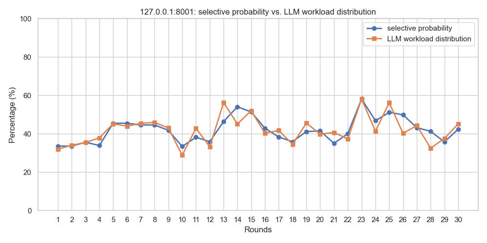
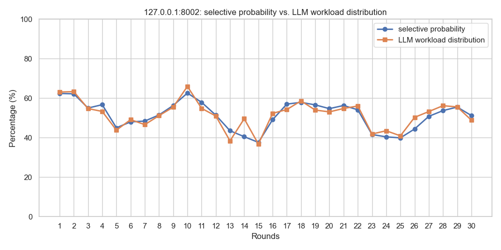
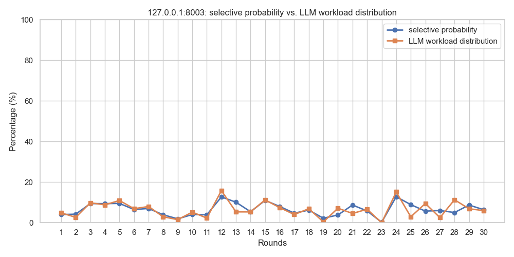

正如Readme文档中所描述，调度器将根据不同推理引擎服务节点的score值进行weight random选择。本文档通过端到端的测试方法来验证调度器工作的有效性。

## 1. 端到端测试评估方法

### F5 Mock API

`./tests/f5-mock-api/f5-mock-api-updated.py`用于模拟F5 iControl Rest。启动该程序:

```
python3 f5-mock-api-update.py
```

该mock API 可以模拟登录验证、tokens获取，以及获取两个pool（`example_pool1`,`example_pool2`)的members信息。程序中的`DYNAMIC_MODE = 0`表示不模拟pool members的增减，始终保持程序中设定的3个成员。如果设置`DYNAMIC_MODE = 1`则表示程序随机模拟Pool members的增减（0-3个成员）。


### LLM Mock API

`./tests/llm-mock-api/main.py`是模拟vLLM的metrics接口的主程序，`./tests/llm-mock-api/main_sglang.py`模拟SGlang的metrics接口的主程序。主程序会启动各自的3个进程，每个进程模拟一个LLM Inference server。启动程序：

```
python3 main.py
python3 main_sglang.py
```

进程程序(如app_vllm.py)，默认10分钟主动变化一次metrics值。也可以通过`/trigger_update` API接口主动触发metrics更新。修改程序中的`DYNAMIC_UPDATE_ENABLED = True` 为`False`可以关闭metrics动态更新。动态更新开关也可以通过API endpoint`POST /toggle_update/1 or /toggle_update/0`来从外部控制。

> 在继续后续的步骤前，你需要启动上述两个API


### 客户端测试程序

`./tests/Client_requests_test_and_caculator_full_report.py` 用于模拟发起到调度器的请求。程序启动时，将询问用户模拟多少轮测试，假设用户输入30，则表示进行30轮测试，每轮测试逻辑如下：

- 向调度器发送1000次API请求。每次请求调度器都会返回一个member信息（根据weight random算法）。在这1000次过程中，LLM的metrics是保持不变的。
- 程序在完成1000次请求后，统计各个member出现的实际百分比概率。
- 程序会通过调度器的`/pools/status` API端点获取本轮次中各个LLM Inference server的score值，来计算各个server的理论百分比概率。
- 程序向LLM mock API的`/trigger_update` 端点发送一次请求，来触发一次metrics值的更新，以方便下轮测试。

程序运行完成后，将自动产生可视化图表文件。

> 注意，如果是远程终端运行，请注释掉此语句plt.show()  # If running locally, you can also uncomment to view in real time


每一轮次测试终端输出类似如下信息：

```
=== Round 1 test begins ===
Test results statistics:
---------------------
Total requests: 1000
Successful requests: 1000
Failed requests: 0
#First column is member, second column is selection probability, third column is percent field from /pools/status interface
----Member selection probability and score distribution probability----
127.0.0.1:8001,33.60%,32.04%
127.0.0.1:8002,62.40%,63.11%
127.0.0.1:8003,4.00%,4.85%
--------------------------------------------
Pausing 1 second, preparing to trigger metrics update...
All metrics update requests executed successfully.

```


### 程序有效性评估结果（端到端测试）

通过模拟30轮（每轮1000次请求），各个Pool member被选择的实际概率与理论概率如下。

图例：

- 蓝色代表实际选择概率
- 橙色代表理论概率

可以发现，程序实际选择结果与理论偏差较小，符合预期。







## 2. 通过调度器自身API接口评价方法

调度器本身提供了一个`analyze` API端点，该接口可以自动在程序内部模拟，并给出各个推理节点选择的实际概率、理论概率、偏差分析（平均偏差、最大偏差、最小偏差、标准差），并根据附件中的评估标准，给出质量最终质量评估。API接口访问：

```
curl -X POST http://localhost:8080/pools/example_pool1/Common/analyze \                                                                            on git:main|…6
   -H "Content-Type: application/json" \
   -d '{
     "pool_name": "example_pool1",
     "partition": "Common",
     "request": "ScheduleRequest",
     "members": ["127.0.0.1:8001", "127.0.0.1:8002", "127.0.0.1:8003"],
     "iterations": 100
   }'
```

输出结果类似如下：

```
  ...
  "overall_statistics": {
    "total_iterations": 1000,
    "successful_selections": 1000,
    "success_rate": 100.0,
    "mean_absolute_deviation": 0.7969,
    "max_absolute_deviation": 1.1954,
    "min_absolute_deviation": 0.121,
    "std_deviation": 0.5885
  },
  "quality_assessment": {
    "quality_grade": "Excellent",
    "quality_score": 99.2,
    "is_acceptable": true,
    "recommendations": [],
    "summary": "Mean deviation 0.7969%, max deviation 1.1954%, quality grade: Excellent"
  },
  ...
```


## 3. 如果你是中文用户，还可以使用如下脚本进行更直观的评测

执行`tests/test_probability_analysis.py`程序，出现如下提示，选择1可以不需要llm-mock-api的运行，如选择2则需要llm-mock-api运行。

```
🎯 加权随机算法概率分析测试工具
==================================================
以下API次数是指调用http://localhost:8080/pools/example_pool1/Common/analyze接口
迭代次数是指该API内部模拟选择所执行的次数
报告中的关于迭代次数的耗时能反应程序内部选择算法的耗时
API的耗时及速率不能代表真实的/scheduler/select API接口性能
==================================================
请选择测试方式:
1. 本地测试（直接调用算法）
2. API测试（通过HTTP接口）,需要环境提供模拟example_pool1的3个成员
3. 算法对比测试
4. 全部测试
5. 自定义iterations的API测试
6. 多次API请求性能测试

请输入选择 (1-6): 1
```

选项1的测试，结果类似如下：

```

📊 概率分析结果:
================================================================================
Pool: example_pool1:Common
成员数: 3, 总Score: 1.5

📈 概率对比:
------------------------------------------------------------
成员                   理论概率         实际概率         绝对偏差
------------------------------------------------------------
127.0.0.1:8001       58.67      % 59.00      % 0.33       %
127.0.0.1:8002       33.33      % 32.30      % 1.03       %
127.0.0.1:8003       8.00       % 8.70       % 0.70       %

📊 整体统计:
  总迭代次数: 1000
  成功选择次数: 1000
  成功率: 100.00%
  平均绝对偏差: 0.69%
  最大绝对偏差: 1.03%
  最小绝对偏差: 0.33%
  偏差标准差: 0.35%

⭐ 质量评估:
  质量等级: Excellent
  质量评分: 99.31
  是否可接受: 是
  总结: Mean deviation 0.6889%, max deviation 1.0333%, quality grade: Excellent
```


### 附录

#### 质量等级定义

| 等级         | 平均偏差 | 最大偏差 | 成功率 | 评价                               |
| ------------ | -------- | -------- | ------ | ---------------------------------- |
| **优秀**     | < 1.0%   | < 2.0%   | > 99%  | 算法表现优异，偏差在正常统计范围内 |
| **良好**     | < 2.0%   | < 5.0%   | > 95%  | 算法表现良好，偏差可接受           |
| **一般**     | < 5.0%   | < 10.0%  | > 90%  | 算法基本可用，有优化空间           |
| **需要优化** | ≥ 5.0%   | ≥ 10.0%  | ≤ 90%  | 算法需要优化或存在问题             |

#### 建议阈值

- **1000次测试**：平均偏差 < 2%，最大偏差 < 5% 为良好
- **10000次测试**：平均偏差 < 1%，最大偏差 < 3% 为优秀