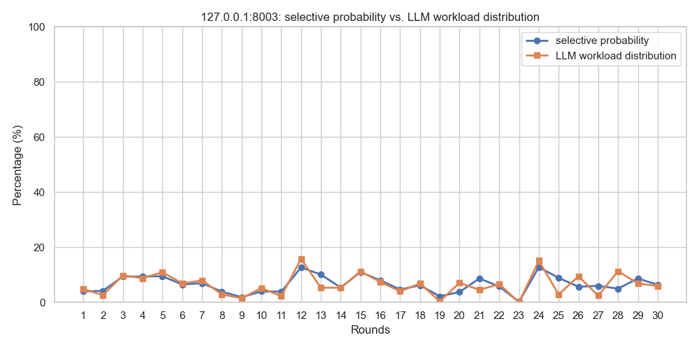

As described in the Readme documentation, the scheduler will perform weighted random selection based on the score values of different inference engine service nodes. This document verifies the effectiveness of the scheduler through end-to-end testing methods.

## 1. End-to-End Testing Evaluation Method

### F5 Mock API

`./tests/f5-mock-api/f5-mock-api-updated.py` is used to simulate F5 iControl Rest. Start this program:

```
python3 f5-mock-api-update.py
```

This mock API can simulate login authentication, token acquisition, and obtaining member information for two pools (`example_pool1`, `example_pool2`). The `DYNAMIC_MODE = 0` in the program indicates that it does not simulate the addition or removal of pool members, always maintaining the 3 members set in the program. If `DYNAMIC_MODE = 1` is set, the program will randomly simulate the addition and removal of pool members (0-3 members).

### LLM Mock API

`./tests/llm-mock-api/main.py` is the main program that simulates vLLM's metrics interface, and `./tests/llm-mock-api/main_sglang.py` simulates SGlang's metrics interface. The main program will start 3 processes each, with each process simulating an LLM Inference server. Start the programs:

```
python3 main.py
python3 main_sglang.py
```

The process program (such as app_vllm.py) changes metrics values automatically every 10 minutes by default. You can also actively trigger metrics updates through the `/trigger_update` API interface. Modify `DYNAMIC_UPDATE_ENABLED = True` to `False` in the program to disable dynamic metrics updates. The dynamic update switch can also be controlled externally through API endpoints `POST /toggle_update/1 or /toggle_update/0`.

> You need start the above 2 API first before the subsequent steps.

### Client Testing Program

`./tests/Client_requests_test_and_caculator_full_report.py` is used to simulate requests to the scheduler. When the program starts, it will ask the user how many rounds of testing to simulate. Assuming the user inputs 30, this means 30 rounds of testing will be conducted, with each round following this logic:

- Send 1000 API requests to the scheduler. Each request will return member information from the scheduler (based on the weighted random algorithm). During these 1000 requests, the LLM metrics remain unchanged.
- After completing 1000 requests, the program counts the actual percentage probability of each member appearing.
- The program obtains the score values of each LLM Inference server in this round through the scheduler's `/pools/status` API endpoint to calculate the theoretical percentage probability of each server.
- The program sends one request to the LLM mock API's `/trigger_update` endpoint to trigger a metrics value update for the next round of testing.

After the program runs, it will automatically generate visualization chart files.

> Note: If running on a remote terminal, please comment out this statement in the python script: 
>
> plt.show() 

Each round of testing terminal output is similar to the following:

```
=== Round 1 test begins ===
Test results statistics:
---------------------
Total requests: 1000
Successful requests: 1000
Failed requests: 0
#First column is member, second column is selection probability, third column is percent field from /pools/status interface
----Member selection probability and score distribution probability----
127.0.0.1:8001,33.60%,32.04%
127.0.0.1:8002,62.40%,63.11%
127.0.0.1:8003,4.00%,4.85%
--------------------------------------------
Pausing 1 second, preparing to trigger metrics update...
All metrics update requests executed successfully.

```

### Program Effectiveness Evaluation Results (End-to-End Testing)

Through simulating 30 rounds (1000 requests per round), the actual probability and theoretical probability of each Pool member being selected are as follows.

Legend:

- Blue represents actual selection probability
- Orange represents theoretical probability

It can be observed that the actual selection results of the program have small deviations from the theoretical values, meeting expectations.




## 2. Evaluation Method Through Scheduler's Own API Interface

The scheduler itself provides an `analyze` API endpoint that can automatically simulate within the program and provide actual probability, theoretical probability, and deviation analysis (mean deviation, maximum deviation, minimum deviation, standard deviation) for each inference node selection. Based on the evaluation criteria in the appendix, it provides final quality assessment. API interface access:

```
curl -X POST http://localhost:8080/pools/example_pool1/Common/analyze \                                                                            on git:main|…6
   -H "Content-Type: application/json" \
   -d '{
     "pool_name": "example_pool1",
     "partition": "Common",
     "request": "ScheduleRequest",
     "members": ["127.0.0.1:8001", "127.0.0.1:8002", "127.0.0.1:8003"],
     "iterations": 100
   }'
```

The output result is similar to the following:

```
  ...
  "overall_statistics": {
    "total_iterations": 1000,
    "successful_selections": 1000,
    "success_rate": 100.0,
    "mean_absolute_deviation": 0.7969,
    "max_absolute_deviation": 1.1954,
    "min_absolute_deviation": 0.121,
    "std_deviation": 0.5885
  },
  "quality_assessment": {
    "quality_grade": "Excellent",
    "quality_score": 99.2,
    "is_acceptable": true,
    "recommendations": [],
    "summary": "Mean deviation 0.7969%, max deviation 1.1954%, quality grade: Excellent"
  },
  ...
```

## 3. If you are Chinese users，还可以使用如下脚本进行更直观的评测

执行`tests/test_probability_analysis.py`程序，出现如下提示，选择1可以不需要llm-mock-api的运行，如选择2则需要llm-mock-api运行。

```
🎯 加权随机算法概率分析测试工具
==================================================
以下API次数是指调用http://localhost:8080/pools/example_pool1/Common/analyze接口
迭代次数是指该API内部模拟选择所执行的次数
报告中的关于迭代次数的耗时能反应程序内部选择算法的耗时
API的耗时及速率不能代表真实的/scheduler/select API接口性能
==================================================
请选择测试方式:
1. 本地测试（直接调用算法）
2. API测试（通过HTTP接口）,需要环境提供模拟example_pool1的3个成员
3. 算法对比测试
4. 全部测试
5. 自定义iterations的API测试
6. 多次API请求性能测试

请输入选择 (1-6): 1
```

选项1的测试，结果类似如下：

```

📊 概率分析结果:
================================================================================
Pool: example_pool1:Common
成员数: 3, 总Score: 1.5

📈 概率对比:
------------------------------------------------------------
成员                   理论概率         实际概率         绝对偏差
------------------------------------------------------------
127.0.0.1:8001       58.67      % 59.00      % 0.33       %
127.0.0.1:8002       33.33      % 32.30      % 1.03       %
127.0.0.1:8003       8.00       % 8.70       % 0.70       %

📊 整体统计:
  总迭代次数: 1000
  成功选择次数: 1000
  成功率: 100.00%
  平均绝对偏差: 0.69%
  最大绝对偏差: 1.03%
  最小绝对偏差: 0.33%
  偏差标准差: 0.35%

⭐ 质量评估:
  质量等级: Excellent
  质量评分: 99.31
  是否可接受: 是
  总结: Mean deviation 0.6889%, max deviation 1.0333%, quality grade: Excellent
```

### Appendix

#### Quality Grade Definitions

| Grade              | Mean Deviation | Max Deviation | Success Rate | Evaluation                                              |
| ------------------ | -------------- | ------------- | ------------ | ------------------------------------------------------- |
| **Excellent**      | < 1.0%         | < 2.0%        | > 99%        | Algorithm performs excellently, deviation within normal statistical range |
| **Good**           | < 2.0%         | < 5.0%        | > 95%        | Algorithm performs well, deviation is acceptable        |
| **Average**        | < 5.0%         | < 10.0%       | > 90%        | Algorithm is basically usable, with room for optimization |
| **Needs Optimization** | ≥ 5.0%    | ≥ 10.0%       | ≤ 90%        | Algorithm needs optimization or has issues              |

#### Recommended Thresholds

- **1000 tests**: Mean deviation < 2%, max deviation < 5% is considered good
- **10000 tests**: Mean deviation < 1%, max deviation < 3% is considered excellent