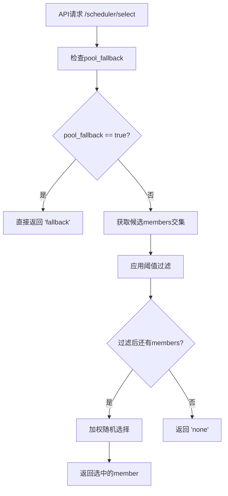

# Fallback功能增强说明文档

## 📋 功能概述

本次更新提供了结构化的fallback功能，包括Pool级别的fallback控制和新的成员级别阈值过滤功能。

### 🔄 主要变更

1. **配置结构重构**：采用`fallback`配置节点管理所有fallback相关配置
2. **Pool级别控制**：`pool_fallback`开关控制整个Pool的fallback行为
3. **新增成员阈值过滤**：支持基于原始metrics值过滤过载的pool member

## 🏗️ 新的配置结构

### 配置语法

```yaml
pools:
  - name: example_pool1
    partition: Common
    engine_type: vllm
    fallback:
      pool_fallback: false                          # Pool级别fallback开关
      member_running_req_threshold: 20.0            # 运行请求数阈值
      member_waiting_queue_threshold: 15.0          # 等待队列阈值
```

### 配置项说明

| 配置项 | 类型 | 必填 | 默认值 | 说明 |
|--------|------|------|--------|------|
| `pool_fallback` | boolean | 否 | false | Pool级别fallback开关，true时API直接返回"fallback" |
| `member_running_req_threshold` | float | 否 | null | 运行请求数阈值，超过则排除该member |
| `member_waiting_queue_threshold` | float | 否 | null | 等待队列阈值，超过则排除该member |

## 🎯 功能详解

### 1. Pool级别Fallback (pool_fallback)

**功能**：整个Pool的强制fallback控制
**使用场景**：Pool维护、故障应急、灰度发布等

```yaml
fallback:
  pool_fallback: true    # 开启后，API直接返回"fallback"
```

**执行时机**：在API层面最早检查，如果为true则跳过所有调度逻辑

### 2. 成员阈值过滤 (member_*_threshold)

**功能**：基于原始metrics值自动排除过载的成员
**使用场景**：负载保护、性能优化、自动故障隔离

```yaml
fallback:
  member_running_req_threshold: 20.0   # running_req > 20时排除
  member_waiting_queue_threshold: 15.0 # waiting_queue > 15时排除
```

**关键特性**：
- ✅ **使用原始metrics值**：直接比较采集的原始数据，不使用归一化后的值
- ✅ **支持独立配置**：可以只设置其中一个阈值
- ✅ **保守策略**：没有metrics数据的member会被保留
- ✅ **详细日志**：记录过滤过程和结果

### 3. 不同引擎的指标映射

系统会根据`engine_type`自动映射到正确的指标名称：

| 引擎类型 | running_req指标 | waiting_queue指标 |
|----------|-----------------|-------------------|
| vllm | `vllm:num_requests_running` | `vllm:num_requests_waiting` |
| sglang | `sglang:num_running_reqs` | `sglang:num_queue_reqs` |

## 🔄 执行流程



### 功能优先级

1. **最高优先级**：`pool_fallback` - Pool级别强制控制
2. **次优先级**：成员阈值过滤 - 自动排除过载member
3. **最后执行**：加权随机选择 - 从剩余member中选择

## 📝 配置示例

### 示例1：

```yaml
- name: production_pool
  partition: Common
  engine_type: vllm
  fallback:
    pool_fallback: false
    member_running_req_threshold: 15.0   
    member_waiting_queue_threshold: 10.0
  metrics:
    schema: http
    path: /metrics
```

### 示例2：

```yaml
- name: test_pool
  partition: TestPartition
  engine_type: sglang
  fallback:
    pool_fallback: false
    member_running_req_threshold: 50.0   
    # 不设置waiting_queue阈值
  metrics:
    schema: http
    path: /metrics
```

### 示例3： Pool级别fallback

```yaml
- name: maintenance_pool
  partition: Common
  engine_type: vllm
  fallback:
    pool_fallback: true                  # Pool级别fallback优先
    # 阈值设置会被忽略，可保留便于维护结束后恢复
    member_running_req_threshold: 20.0
    member_waiting_queue_threshold: 15.0
  metrics:
    schema: http
    path: /metrics
```

### 示例4：仅Pool级别控制

```yaml
- name: simple_pool
  partition: Common
  engine_type: vllm
  fallback:
    pool_fallback: false
    # 不设置成员阈值，不进行member级别过滤
  metrics:
    schema: http
    path: /metrics
```

## 🔄 配置热更新

所有fallback配置都支持热更新：

1. **修改配置文件**
2. **等待自动检测**（默认5秒）
3. **查看日志确认**

```
INFO - Updated Pool production_pool:Common pool_fallback: True
INFO - Updated Pool production_pool:Common member_running_req_threshold: 25.0
INFO - Updated Pool production_pool:Common member_waiting_queue_threshold: 20.0
```

## 📊 提示

1. 当设置为Pool级别的fallback时候，F5向调度器查询关于该pool的最优节点查询都会得到fallback的返回内容，此时F5侧iRule可以根据该返回做出不同的决定，如：

- 直接返回友好性错误内容。可用于临时关停整个推理资源池场景，例如运维维护、紧急停机等。
- 将请求直接按照普通的负载均衡算法进行分配。可用于临时暂停调度器的优选工作。
- 将请求发送到其它推理资源池。实现推理资源的备份切换、跨中心调度、模型资源池的AB发布。


2. 如设置member级别的fallback阀值，当任意一个指标超过对应阀值时，该member将不会被选为最优节点。该功能可实现如下场景：

- 巧用阀值，可实现临时下线某个节点
- 巧用阀值，可实现让某个节点始终处于低水位工作
- 正确设置阀值，让繁忙节点临时自动被排除，从而避免繁忙节点过于繁忙

>  需要注意的是running request一般可以用于防止节点进入高水位工作状态，即可用来设置一个较为统一的平衡状态，保证每个节点都不超过水位设置。如推理资源池内的节点本身性能差异较大，需注意这个指标是水桶理论中的最低点。
>
> waiting request一般可以直接与繁忙挂钩，设置该阀值可以避免节点产生过高的waiting queue。