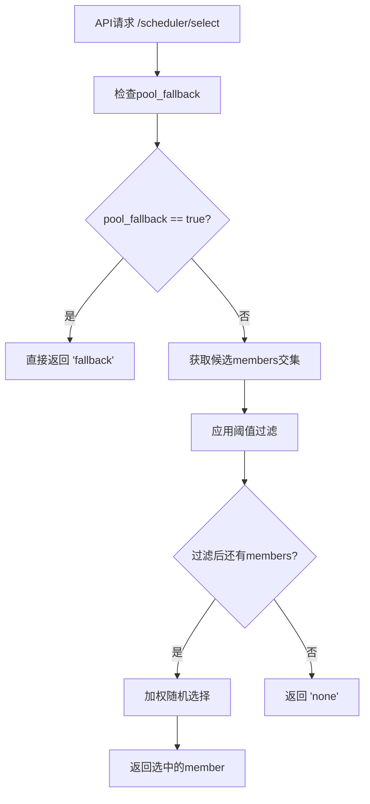

# Fallback功能增强说明文档

## 📋 功能概述

本次更新提供了结构化的fallback功能，包括Pool级别的fallback控制和新的成员级别阈值过滤功能。

### 🔄 主要变更

1. **配置结构重构**：采用`fallback`配置节点管理所有fallback相关配置
2. **Pool级别控制**：`pool_fallback`开关控制整个Pool的fallback行为
3. **新增成员阈值过滤**：支持基于原始metrics值过滤过载的pool member

## 🏗️ 新的配置结构

### 配置语法

```yaml
pools:
  - name: example_pool1
    partition: Common
    engine_type: vllm
    fallback:
      pool_fallback: false                          # Pool级别fallback开关
      member_running_req_threshold: 20.0            # 运行请求数阈值
      member_waiting_queue_threshold: 15.0          # 等待队列阈值
```

### 配置项说明

| 配置项 | 类型 | 必填 | 默认值 | 说明 |
|--------|------|------|--------|------|
| `pool_fallback` | boolean | 否 | false | Pool级别fallback开关，true时API直接返回"fallback" |
| `member_running_req_threshold` | float | 否 | null | 运行请求数阈值，超过则排除该member |
| `member_waiting_queue_threshold` | float | 否 | null | 等待队列阈值，超过则排除该member |

## 🎯 功能详解

### 1. Pool级别Fallback (pool_fallback)

**功能**：整个Pool的强制fallback控制
**使用场景**：Pool维护、故障应急、灰度发布等

```yaml
fallback:
  pool_fallback: true    # 开启后，API直接返回"fallback"
```

**执行时机**：在API层面最早检查，如果为true则跳过所有调度逻辑

### 2. 成员阈值过滤 (member_*_threshold)

**功能**：基于原始metrics值自动排除过载的成员
**使用场景**：负载保护、性能优化、自动故障隔离

```yaml
fallback:
  member_running_req_threshold: 20.0   # running_req > 20时排除
  member_waiting_queue_threshold: 15.0 # waiting_queue > 15时排除
```

**关键特性**：
- ✅ **使用原始metrics值**：直接比较采集的原始数据，不使用归一化后的值
- ✅ **支持独立配置**：可以只设置其中一个阈值
- ✅ **保守策略**：没有metrics数据的member会被保留
- ✅ **详细日志**：记录过滤过程和结果

### 3. 不同引擎的指标映射

系统会根据`engine_type`自动映射到正确的指标名称：

| 引擎类型 | running_req指标 | waiting_queue指标 |
|----------|-----------------|-------------------|
| vllm | `vllm:num_requests_running` | `vllm:num_requests_waiting` |
| sglang | `sglang:num_running_reqs` | `sglang:num_queue_reqs` |

## 🔄 执行流程



### 功能优先级

1. **最高优先级**：`pool_fallback` - Pool级别强制控制
2. **次优先级**：成员阈值过滤 - 自动排除过载member
3. **最后执行**：加权随机选择 - 从剩余member中选择

## 📝 配置示例

### 示例1：生产环境 - 严格阈值控制

```yaml
- name: production_pool
  partition: Common
  engine_type: vllm
  fallback:
    pool_fallback: false
    member_running_req_threshold: 15.0   # 严格限制
    member_waiting_queue_threshold: 10.0
  metrics:
    schema: http
    path: /metrics
```

### 示例2：测试环境 - 宽松设置

```yaml
- name: test_pool
  partition: TestPartition
  engine_type: sglang
  fallback:
    pool_fallback: false
    member_running_req_threshold: 50.0   # 宽松阈值
    # 不设置waiting_queue阈值
  metrics:
    schema: http
    path: /metrics
```

### 示例3：维护模式 - Pool级别fallback

```yaml
- name: maintenance_pool
  partition: Common
  engine_type: vllm
  fallback:
    pool_fallback: true                  # Pool级别fallback优先
    # 阈值设置会被忽略，但保留便于维护结束后恢复
    member_running_req_threshold: 20.0
    member_waiting_queue_threshold: 15.0
  metrics:
    schema: http
    path: /metrics
```

### 示例4：仅Pool级别控制

```yaml
- name: simple_pool
  partition: Common
  engine_type: vllm
  fallback:
    pool_fallback: false
    # 不设置成员阈值，不进行member级别过滤
  metrics:
    schema: http
    path: /metrics
```

## 🔧 配置格式

所有fallback相关配置都统一在`fallback`节点下：

```yaml
- name: example_pool
  fallback:
    pool_fallback: false                    # Pool级别控制
    member_running_req_threshold: 20.0      # 成员级别过滤
    member_waiting_queue_threshold: 15.0    # 成员级别过滤
```

## 🔄 配置热更新

所有fallback配置都支持热更新：

1. **修改配置文件**
2. **等待自动检测**（默认5秒）
3. **查看日志确认**

```
INFO - Updated Pool production_pool:Common pool_fallback: True
INFO - Updated Pool production_pool:Common member_running_req_threshold: 25.0
INFO - Updated Pool production_pool:Common member_waiting_queue_threshold: 20.0
```

## 📊 运维建议

### 1. 阈值设置建议

| 环境类型 | running_req阈值 | waiting_queue阈值 | 说明 |
|----------|-----------------|-------------------|------|
| 生产环境 | 15-25 | 10-20 | 严格控制，确保性能 |
| 测试环境 | 30-50 | 20-30 | 相对宽松，便于测试 |
| 开发环境 | 不设置 | 不设置 | 无限制，便于开发调试 |

### 2. 监控指标

建议监控以下指标：
- 被阈值过滤的member数量
- Pool级别fallback的触发频率
- 过滤后剩余member数量

### 3. 故障处理流程

1. **发现Pool异常** → 立即开启`pool_fallback: true`
2. **排查问题** → 分析metrics和日志
3. **调整阈值** → 根据实际情况优化阈值设置
4. **恢复服务** → 关闭pool_fallback，验证正常

## 🧪 测试验证

项目包含完整的测试用例 (`tests/test_fallback_with_thresholds.py`)：

```bash
# 运行测试
python3 tests/test_fallback_with_thresholds.py
```

测试覆盖：
- ✅ 配置结构解析
- ✅ Pool模型属性
- ✅ API层面逻辑
- ✅ 阈值过滤功能
- ✅ 优先级验证

## 📈 性能影响

### 新功能的性能影响：

1. **配置解析**：增加少量配置解析时间（微秒级）
2. **阈值过滤**：增加O(n)时间复杂度的member过滤（n为member数量）
3. **内存使用**：每个Pool增加3个属性的内存开销（negligible）

### 优化措施：

- 过滤逻辑只在有阈值设置时执行
- 使用原始metrics值，无需额外计算
- 详细日志仅在debug模式下输出

## 📋 总结

本次fallback功能增强实现了：

### ✅ 功能增强
- **更清晰的配置结构**：逻辑分组，易于理解
- **成员级别过滤**：自动排除过载成员
- **完整的日志记录**：便于调试和监控

### ✅ 技术特性  
- **使用原始metrics**：准确反映实际负载情况
- **配置热更新**：运行时动态调整
- **完整测试覆盖**：确保功能可靠性

### ✅ 运维友好
- **层次化控制**：Pool级别 + Member级别
- **灵活配置**：可独立使用或组合使用  
- **详细日志**：完整的过滤和选择过程记录

这些增强功能为F5 LLM推理网关调度器提供了更强大和灵活的负载控制能力，能够更好地应对各种生产环境的需求。 